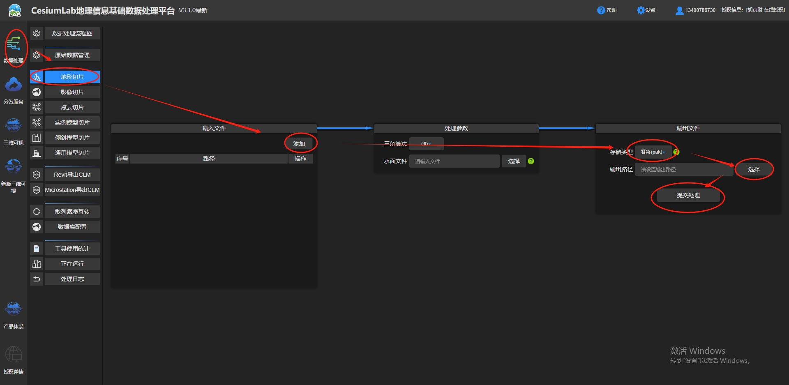
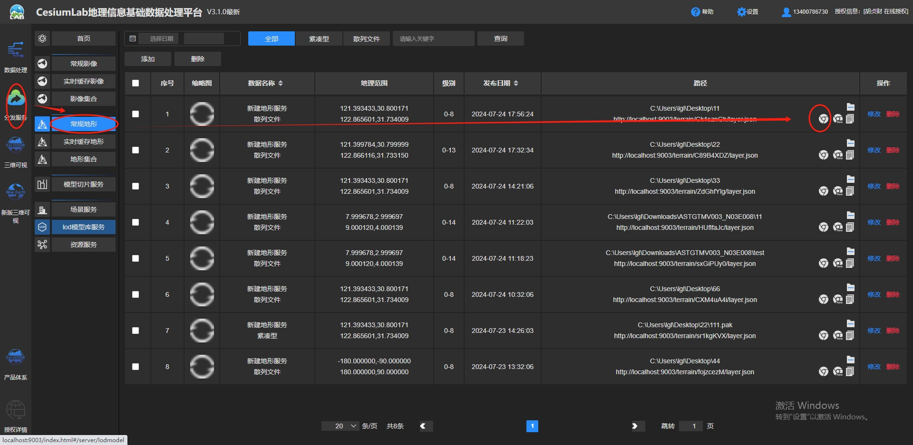
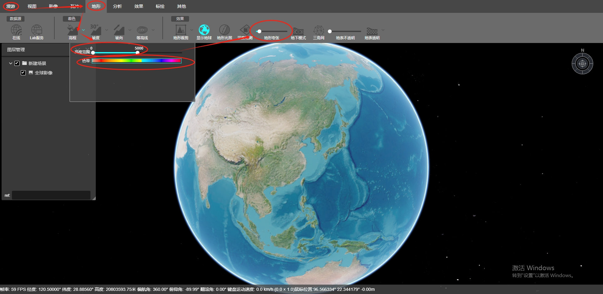

# 3D2tiff

## 1. json2tif

### 1.1. data format

origin data:
``` json
"features": [{
		"type": "Feature",
		"geometry": {
			"type": "Point",
			"coordinates": [122.6110446,
			31.0377298,
			17.1]
		},
		"properties": {
			"FOID": "CN 0001571642 22501",
			"EXPSOU": "",
			"NOBJNM": "",
			"OBJNAM": "",
			"QUASOU": "",
			"SOUACC": null,
			"STATUS": "",
			"TECSOU": "",
			"VERDAT": "",
			"$SCODE": "",
			"SCAMIN": null,
			"SCAMAX": null,
			"NTXTDS": "",
			"TXTDSC": "",
			"$spinf": "",
			"$AISIF": "",
			"$SORID": "",
			"INFORM": "",
			"NINFOM": "",
			"RECDAT": "",
			"RECIND": "",
			"SORDAT": "20090316",
			"SORIND": "CN,CN,graph,surveyCN3G0611",
			"ProductTem": ""
		}
	}
```

### 1.2. generate grid
``` python
pixel_size = 0.000576639388
nx = int((max(x) - min(x)) / pixel_size)
ny = int((max(y) - min(y)) / pixel_size)

x_grid = np.linspace(min(x), max(x), nx)
y_grid = np.linspace(min(y), max(y), ny)
x_grid, y_grid = np.meshgrid(x_grid, y_grid)

from scipy.interpolate import griddata
z_grid = griddata((x, y), z, (x_grid, y_grid), method='linear')
z_grid = np.nan_to_num(z_grid, 0)
```

### 1.3. convert
```python
transform = from_bounds(min(x_grid[0]), min(y_grid[:,0]), max(x_grid[0]), max(y_grid[:,0]), width, height)

with rasterio.open(
    outputfile,
    'w',
    driver='GTiff',
    height=z_grid.shape[0],
    width=z_grid.shape[1],
    count=1,
    dtype=z_grid.dtype,
    crs='EPSG:4326',
    compress='LZW',
    tiled=True,
    blockxsize=256,
    blockysize=256,
    transform=transform,
    nodata=-9999
) as dst:
    #dst.update_tags(DataType='Generic')
    dst.set_band_description(1, 'Band 1')
    dst.update_tags(AREA_OR_POINT='Area', Band_1='Band 1')
    #dst.update_tags(1, RepresentationType='ATHEMATIC')
    dst.write(z_grid, 1)
```
## 2. tif2terrain
use CesiumLab
### 2.1. load tif data and process


### 2.2. how to preview


### 2.3. parameter settting
if you can see the object, you may modify the height and color
